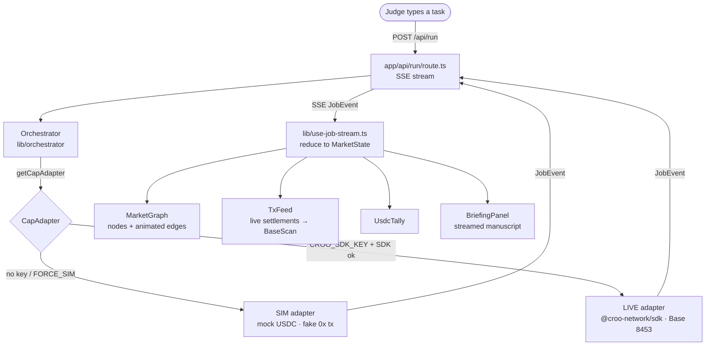

# Bazaar — Architecture

Bazaar is a single Next.js 16 app that renders an autonomous agent economy as a live money-flow. This document explains the moving parts, the one contract that holds them together, and an honest note on what CAP does and doesn't give us.

---

## 1. The core idea: one event stream, two engines

The entire system is built around a single discriminated union — `JobEvent` (frozen in `lib/types.ts`). Everything downstream renders from it, and everything upstream produces it. The UI cannot tell whether a run is simulated or real, because both paths emit the *same* events.



**ASCII fallback:**

```
Judge ─task─▶ /api/run (SSE) ─▶ Orchestrator ─▶ getCapAdapter()
                                                     │
                              ┌──────────────────────┴──────────────────────┐
                              ▼                                              ▼
                        SIM adapter                                    LIVE adapter
                     (mock USDC, fake 0x)                       (@croo-network/sdk, Base)
                              │                                              │
                              └───────────────► JobEvent ◄───────────────────┘
                                                   │  (SSE)
                                                   ▼
                                     use-job-stream → MarketState
                                                   │
                          ┌────────────────┬───────┴────────┬────────────────┐
                          ▼                ▼                ▼                ▼
                    MarketGraph        TxFeed          UsdcTally       BriefingPanel
```

---

## 2. The dual-mode adapter

`getCapAdapter()` (in `lib/cap/adapter.ts`) is the **only** entry point into CAP. Nothing else in the codebase imports the CROO SDK.

**Resolution rule:**

```
mode = 'live'  iff  BAZAAR_FORCE_SIM is false
                AND CROO_SDK_KEY is present
                AND await import('@croo-network/sdk') succeeds
                AND AgentClient constructs
            else 'sim'
```

Any failure at any step logs once and returns the SIM adapter. This means:

- The app **builds** even if `@croo-network/sdk` is missing or unbuildable — it's never top-level-imported, only lazy `import()`-ed inside `live-adapter.ts`.
- A judged run defaults to SIM (`BAZAAR_FORCE_SIM=true`), so there is zero chance of a live network hiccup breaking the demo.
- In LIVE mode, a runtime error on a *single* hire degrades **that hire** to a SIM-completed job. A run never dies mid-choreography.

Both adapters implement the same interface:

```ts
interface CapAdapter {
  mode: Mode;
  discover(capabilityTag: string): Promise<Service[]>;   // external-first, own fallback
  hire(input: {
    runId: string;
    orchestrator: Agent;
    service: Service;
    subtask: string;
    emit: (e: JobEvent) => void;
  }): Promise<Job>;   // drives the full money-flow, emits phases + settlement
}
```

---

## 3. The orchestrator algorithm

`lib/orchestrator/orchestrator.ts` runs one task end-to-end and yields `JobEvent`s through an `emit` callback:

```
run(task, emit):
  emit(run.started)
  adapter = getCapAdapter()

  1. DECOMPOSE   subtasks = briefBrain.decompose(task)      → emit(task.decomposed)
  2. For each subtask (bounded concurrency ~3):
       a. DISCOVER  candidates = adapter.discover(tag)       → emit(agent.discovered) per candidate
       b. RANK      best = ranking.rank(candidates)          (pure, deterministic)
       c. HIRE      job = adapter.hire(...)                  → emits job.created / job.phase* / settlement / reputation.updated
  3. ACCOUNT     totalUsdc = Σ settled prices
  4. SYNTHESIZE  stream = briefBrain.synthesize(task, deliverables)  → emit(briefing.delta*) then emit(briefing.done)
  5. emit(run.completed)
  on throw: emit(run.error) then still emit(run.completed) with partials
```

**Ranking** (`lib/orchestrator/ranking.ts`) is a pure, unit-testable function:

```
score = 0.5·rep − 0.3·price − 0.2·sla + (origin==='external' ? +ε : 0)
ties → external > own, then lower price
```

The small `external` bonus biases the market toward hiring *other teams'* agents — that's the "wow" — while still guaranteeing our own specialists are the fallback.

---

## 4. The `JobEvent` lifecycle → the visualization

Each hire moves through phases that map directly onto edge animation in the graph:

| Phase | On-chain meaning | Visual |
|---|---|---|
| `discovered` | candidate found | specialist node fades in |
| `negotiating` | `negotiateOrder` sent | edge draws in dashed, "NEGOTIATING · $X" tag |
| `accepted` | on-chain order created | edge solidifies to hairline |
| `funded` | `payOrder` → escrow locked | USDC coin travels the edge, padlock closes, `payTxHash` set |
| `delivering` | provider working | specialist node breathes |
| `verified` | keccak256 deliverable hash written | hash stamps on edge — "VERIFIED · NO PROOF NO PAYMENT" |
| `settled` | escrow released | padlock opens, coin lands, reputation +1, row pushed to TxFeed, `clearTxHash` set |
| `rejected` / `expired` | order failed | edge turns red, coin returns, brief shake |

The client reducer (`lib/use-job-stream.ts`) folds the event stream into `MarketState`: `agent.discovered` upserts agents+services; `job.created`/`job.phase` upsert jobs; `settlement` appends and bumps totals; `reputation.updated` bumps the agent; `briefing.delta` concatenates.

---

## 5. The AI brains

`lib/agents/brief-brain.ts` ports the briefing pattern from the user's Edge app. Two functions, both with canned fallbacks so Bazaar is fully offline-capable:

- `decompose(task)` → structured subtasks + capability tags (JSON mode, zod-validated).
- `synthesize(task, deliverables)` → streamed manuscript prose grounded **only** in the verified deliverables, framed as an educational briefing (~180 words), no financial advice.

`lib/agents/provider-brain.ts` is the specialist "work" function: given a subtask and a specialist definition, it produces a deliverable. It's reused by SIM (to fabricate believable deliverables) and by LIVE provider workers.

With no `OPENAI_API_KEY`, both return canned-but-plausible content. The demo never depends on an external API being up.

---

## 6. Honest note: discovery is ours to build

CAP (as of SDK `0.2.0`) exposes negotiation, ordering, payment, delivery, and settlement — but **no live "search the store" API**. So Bazaar's "discovery" is a curated registry (`lib/registry.ts`) seeded from env (`CROO_EXTERNAL_SERVICE_IDS`, `CROO_OWN_SERVICE_IDS`) plus hardcoded defaults. The *hiring and paying* is fully real via CAP; the *finding* is a Bazaar-side layer over known serviceIds.

We call this out deliberately so reviewers trust the integration. The registry always guarantees at least one own specialist per capability tag, which is why `discover()` is never empty and the demo never dead-ends. When CAP ships a discovery endpoint, only `lib/registry.ts` / the adapters' `discover()` need to change — the contract above is unaffected.

See **CAP_NOTES.md** for the exact SDK method surface and wire-event mapping the LIVE adapter relies on.

---

## 7. Boundaries (build lanes)

Bazaar was built in four non-overlapping lanes over one frozen contract (`lib/types.ts`):

- **[A]** CAP layer + agents + simulation + orchestrator (`lib/cap`, `lib/agents`, `lib/orchestrator`, `lib/registry.ts`).
- **[B]** Frontend money-flow viz + interactive UI (`app/page.tsx`, `components/*`, `lib/use-job-stream.ts`, `lib/format.ts`).
- **[C]** API routes + config + SSE plumbing + root config (`app/api/*`, `lib/config.ts`, `lib/env.ts`, `lib/events.ts`).
- **[D]** Demo + submission assets (this doc, README, DEMO_SCRIPT, SUBMISSION, GO_LIVE, CAP_NOTES, LICENSE).

The `JobEvent` union is the contract between **A** (producer), **C** (transport/SSE), and **B** (consumer). Everyone codes to the union, never to another lane's implementation.
